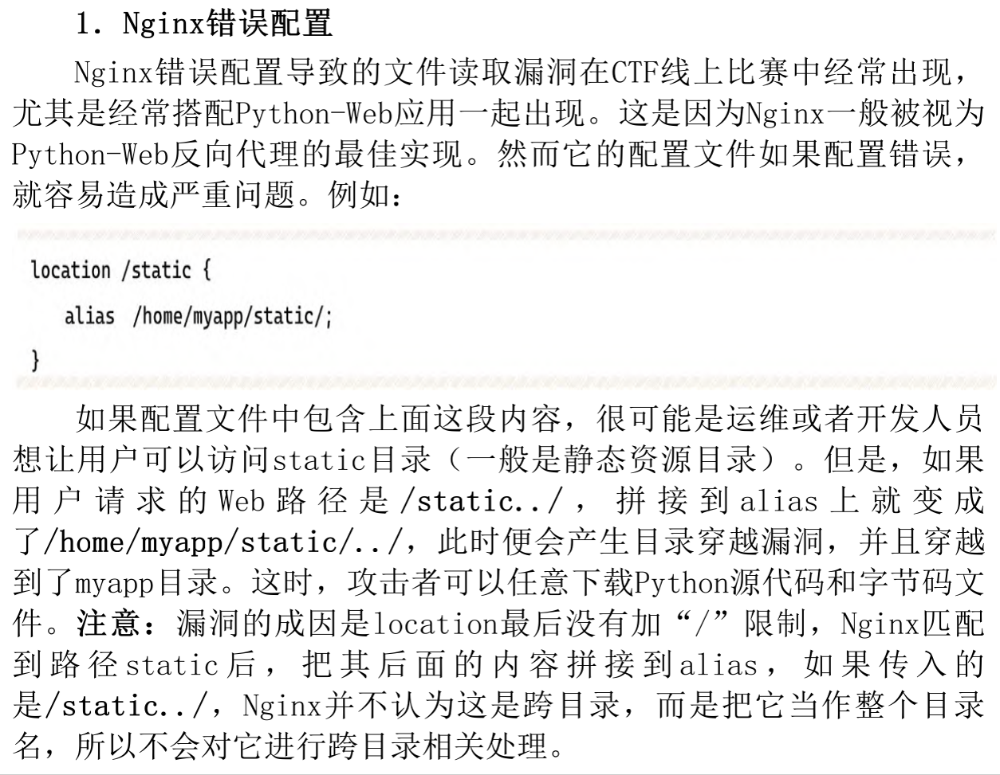
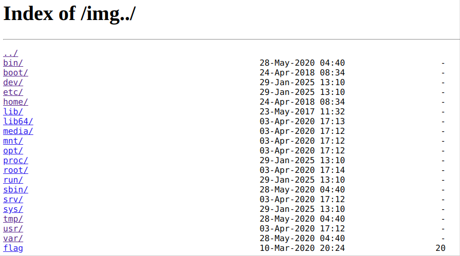
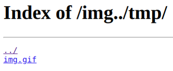

## PHP协议
> 例题：BUUCTF N1BOOK \[第一章 web入门\]afr_1

### php://filter
```url
http://example.com/php://filter/read=convert.base64-encode/resource=<file_name>
```
> 以 `Base64` 编码输出文件内容，避免 `php` 文件被服务器执行过再输出

### Nginx配置错误
参考：《从0到1：CTFer成长之路》



通过写入 `/img..` 可穿越到根目录。





可知 `/img` 被解析到了 `/tmp` 上。

### 